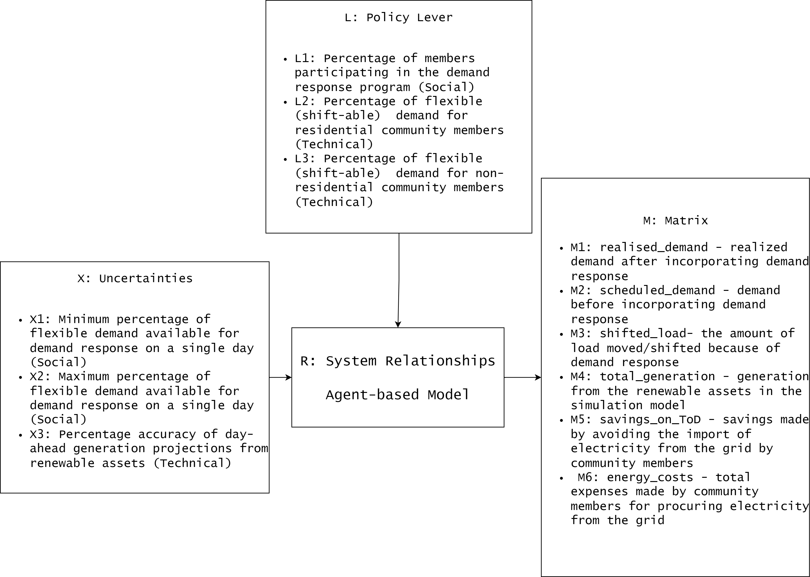
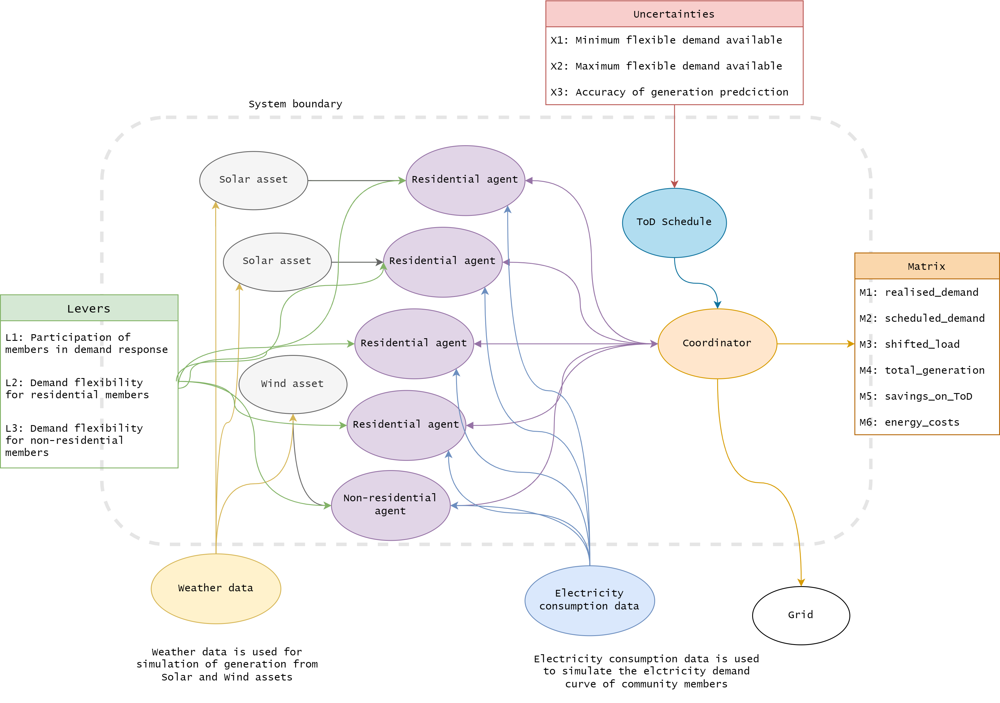

[Home](https://sonianmol.com/)

# Exploring demand response in energy communities

This project is the masters thesis for M.Sc. Engineering and Policy Analysis at TU Delft. In this project, an
agent-based model of energy community is created using `mesa` library. This model serve as a testing ground for testing
demand response policies on the modeled energy communities.

## Authors

- [@SoniAnmol](https://www.github.com/SoniAnmol) - Anmol Soni

## Current state

This model is currently in development. This document will be updated shortly.

## General information

This project is a thesis project done in collaboration with [Croonwolter&Dros](https://croonwolterendros.nl/). This
model is primary focused on electric energy communities and can be extended to other energy sources. The model is used
to evaluate demand response with in energy communities while ensuring fair distribution of cost and benefits among
community members.

## Repository structure

./Modelling-Dutch-Energy-Communities/
├── data
├── evidence files
│   ├── figures_validation
│   ├── figures_verification
│   ├── Model-validation-setup.png
│   ├── model_validation.ipynb
│   └── mode_verification.ipynb  
├── example
│   ├── check_results.ipynb                 
│   └── simulation.py                     # Example script to run the model
├── images
├── model                          
          
└── README.md          

```angular2html
./Modelling-Dutch-Energy-Communities/
│
├───data                         
│   ├───.ipynb_checkpoints       
│   ├───processed                
│   └───raw                      
├───evidence_files               
│   ├───figures_validation       
│   └───figures_verification     
├───example                      
├───experiments                  
│   └───figures                  
│       ├───greone_mient         
│       └───gridflex             
├───images                       
│   └───UML                      
├───model
│   └───__pycache__
└───results

```


## Model

### XLRM Framework



### System Relationship



## Community members

This model has following demand profiles in the data bank. These demand profiles can be combined in different
permutations and cobinations for creating community configurations.

- Three demand profiles for residential community members
- Four demand profiles for non-residential community members (office buildings)
- Demand profile of a School (MBO)
- Demand profile of an EV charging station with three slow chargers

